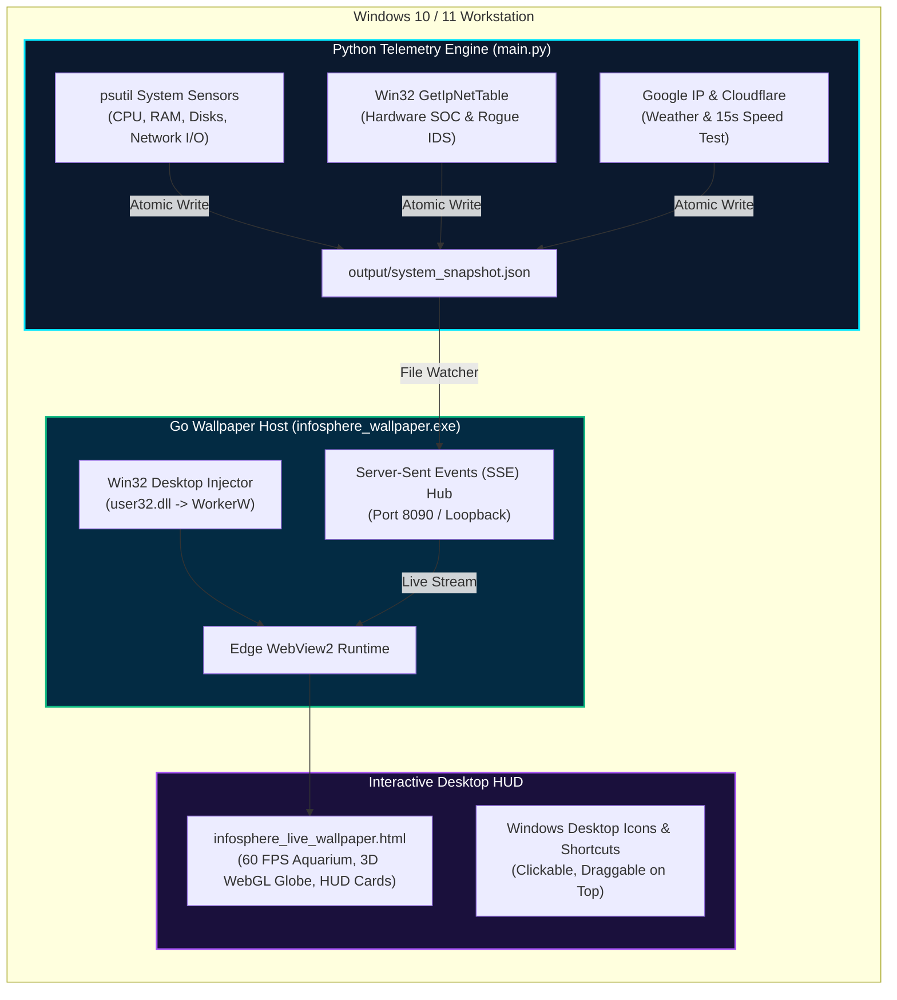

<div align="center">

# 🌐 INFOSPHERE · TACTICAL CYBER LIVE ENGINE
### Executive 60 FPS Live Wallpaper · SOC Intrusion Telemetry · 3D Geospatial Defense Matrix

[-0078D6?style=for-the-badge&logo=windows)](https://www.microsoft.com/windows)
[](https://go.dev/)
[](https://www.python.org/)
[](https://github.com/nazmulhaquebz/InfoSphere_wallpaper)
[](LICENSE)
[](SECURITY.md)

<br/>


<br/>

**Transform your standard Windows desktop into an aerospace-grade, real-time Security Operations Center (SOC) HUD.**<br/>
Native Windows `WorkerW` embedding · Zero desktop icon collision · 100% background silent operation.

</div>

---

## 🛡️ Ethical Use & Responsible Monitoring Manifesto

> [!IMPORTANT]
> **PLEASE READ BEFORE USE:**
> 
> **InfoSphere** is engineered strictly for **defensive, aesthetic, educational, and authorized personal workstation observability**.
> 
> - **Authorized Use Only**: Only monitor hardware, network interfaces, and routers that you personally own or have explicit authorization to inspect.
> - **No Malicious Capability**: InfoSphere contains **no offensive exploit tools, credential harvesters, port flooding, or unauthorized packet sniffing capabilities**.
> - **Local-Only Privacy**: All system metrics, local ARP tables, and telemetry snapshots reside exclusively in volatile memory and local JSON storage (`127.0.0.1`). **No user data, keystrokes, or network credentials are ever sent to external cloud servers or third-party trackers.**
> - **Ethical Compliance**: Users worldwide must adhere to their local cybersecurity laws, computer fraud statutes, and organizational Acceptable Use Policies (AUP).

---

## ✨ Key Architectural Features

### 1. 🖥️ Native Windows `WorkerW` Desktop Integration
- Injected directly into the Windows desktop message loop between the wallpaper layer and shell desktop icons (`WorkerW` handle via `user32.dll`).
- **Desktop icons and shortcuts remain 100% interactive, clickable, and draggable** on top.
- Zero border windows, zero taskbar presence, and zero desktop click interference.

### 2. 🐟 60 FPS Bioluminescent Antigravity Pond
- Dynamic interactive central water pond with **10 unique Japanese Koi and Goldfish specimens**.
- Real-time physics simulation with water turbulence ripple effects (SVG Fractal Noise displacement filter).
- Smooth mathematical spline flocking and obstacle avoidance algorithms running at locked 60 frames per second.

### 3. 🌐 3D Geospatial CIRT Threat Defense Matrix
- High-density spherical point-cloud globe composed of **4,000+ calculated coordinates**.
- Features 3D parabolic laser attack arcs with protocol-colored vectors (TCP Cyan, UDP Crimson, DNS Amber, HTTP3 Violet).
- Dual orbital gyroscopes, rotating cardinal markers, and critical infrastructure telemetric beacons (Dhaka BDIX, Kuakata SMW5, Cox's Bazar SMW4).

### 4. ⚡ 15-Second Real-Time Speed Benchmark
- Ultra-low-overhead micro-burst throughput testing with Cloudflare Dhaka BDIX edge endpoints.
- Measures real-time **Download Mbps, Upload Mbps, Latency, and Jitter**.
- Completes in under 1.5 seconds and consumes <2.5 MB bandwidth per cycle — **never lags your gaming, streaming, or browsing**.

### 5. 🛡️ Hardware-Level SOC Router Analyzer & IDS
- Reads active local network interfaces and hardware ARP tables via native Win32 `GetIpNetTable` in `iphlpapi.dll`.
- **Zero Console Popups**: Operates 100% in-process without invoking shell commands or flashing terminal windows.
- Resolves device manufacturer vendors via IEEE OUI database and immediately flags unknown intruder devices as `● ROGUE ALERT`.

### 6. ⛅ Google IP Local Weather Engine
- Auto-detects local ISP public IP, ISP provider, and city coordinates.
- Real-time hyper-local temperature (°C and °F), meteorological condition, humidity, and wind speed.

### 7. 🎨 Instant 6-Theme Tactical Palette Switcher
- Switch aesthetic color schemes on the fly directly from the header controls:
  - 🔷 **Cyber Cyan** (Default Tactical Blue)
  - 🟢 **Emerald Matrix** (Terminal Green)
  - 🟡 **Imperial Gold** (Command Amber)
  - 🟣 **Stealth Violet** (Deep Cyberpunk)
  - 🔴 **Crimson Alert** (High-Threat Red)
  - ⚪ **Titanium OLED** (Pure Monochromatic Minimal)

---

## 🏗️ System Architecture



---

## 💻 Prerequisites (First-Time Install)

Before running InfoSphere on any computer, verify the following prerequisites:

| Requirement | Supported Version | Purpose | Download |
|---|---|---|---|
| **Operating System** | Windows 10 or 11 (64-bit) | WorkerW desktop embedding | Built-in |
| **Python** | 3.10 or newer | Background telemetry engine | [python.org](https://www.python.org/downloads/) |
| **WebView2** | Evergreen Runtime | Live HTML5/WebGL rendering | [Microsoft WebView2](https://developer.microsoft.com/en-us/microsoft-edge/webview2/) *(Pre-installed on most PCs)* |
| **Git** *(optional)* | 2.x+ | Cloning repository | [git-scm.com](https://git-scm.com/downloads) |

> [!CAUTION]
> **DURING PYTHON INSTALLATION:** Ensure you check the box:
> **`☑ Add python.exe to PATH`** on the very first installation screen!

*(Note: Go compiler is **NOT** needed for everyday users because the pre-compiled `infosphere_wallpaper.exe` binary is already included).*

---

## 🚀 Step-by-Step Installation ("One by One")

### Step 1: Clone or Download the Project
Open PowerShell or Command Prompt:
```cmd
git clone https://github.com/nazmulhaquebz/InfoSphere_wallpaper.git
cd InfoSphere_wallpaper
```
*(Or click **Code ➔ Download ZIP** on GitHub and extract to any folder on your computer).*

---

### Step 2: Install Python Dependencies
Run this single command inside the folder:
```cmd
python -m pip install -r requirements.txt
```
*This installs three standard libraries: `Pillow`, `psutil`, and `speedtest-cli`.*

---

### Step 3: Launch InfoSphere
Simply double-click:
👉 **`START_INFOSPHERE.bat`**

- Launches the telemetry engine and Go live wallpaper seamlessly.
- Embeds immediately into your desktop background.
- Zero command prompt windows stay open — **100% silent background operation**.

---

### Step 4 (Optional): Enable Auto-Start on Windows Boot
If you want the live wallpaper to automatically start every time you log into Windows:
👉 Double-click **`install_autostart_windows.bat`**

- Configures a silent entry in your user registry (`HKCU\Software\Microsoft\Windows\CurrentVersion\Run`).
- Starts smoothly on startup with no terminal popups.
- To disable autostart later, double-click **`remove_autostart_windows.bat`**.

---

### Step 5: Stop the Wallpaper
To turn off the wallpaper and restore your standard desktop:
👉 Double-click **`STOP_INFOSPHERE.bat`**

- Cleanly terminates the Go wallpaper host, WebView2 instances, and Python telemetry engine, and frees port 8090.

---

## ⚙️ Configuration Reference (`config.json`)

All features are customizable via `config.json`:

| Parameter | Type | Default | Description |
|---|---|---|---|
| `refresh_interval_seconds` | Float | `1.0` | Telemetry refresh rate (seconds) |
| `show_weather` | Boolean | `true` | Enable/disable Google IP weather module |
| `weather_city` | String | `"auto"` | `"auto"` for IP geolocation or type city name |
| `speedtest.enabled` | Boolean | `true` | Enable/disable network benchmark |
| `speedtest.speed_interval_s`| Integer | `15` | Interval between speed tests (seconds) |
| `speedtest.ping_host` | String | `"8.8.8.8"` | Target host for ICMP/TCP latency & jitter |
| `router.enabled` | Boolean | `true` | Enable/disable hardware SOC network analyzer |
| `router.refresh_secs` | Integer | `10` | Frequency of ARP table sweep |
| `colors.accent_cyan` | String | `"#00E5FF"` | Primary tactical HUD accent color |

---

## 🔒 Privacy & Data Security Guarantee

- **Zero Cloud Leakage**: No telemetry, system configurations, Wi-Fi SSIDs, or hardware MAC addresses are transmitted to external servers.
- **Loopback Enforcement**: Internal communication uses strictly `127.0.0.1`.
- **Read-Only Inspection**: Network discovery uses standard operating system ARP lookups; it never transmits aggressive packets, port scans, or exploitation payloads.

---

## 👨‍💻 Author & Acknowledgements

- **Lead Developer**: **Mohammad Nazmul Haque**
- **GitHub**: [@nazmulhaquebz](https://github.com/nazmulhaquebz)
- **Location**: Tulshipur, Madhabpur, Habiganj, Bangladesh
- **Contact**: [nazmul2121@gmail.com](mailto:nazmul2121@gmail.com)

---

## 📜 License

This project is open-source under the **MIT License with Ethical Use Addendum**.  
See the full [`LICENSE`](LICENSE) file for complete terms.

```
Copyright (c) 2026 Mohammad Nazmul Haque. All rights reserved.
Ethical System Observability · Defensive Workstation HUD · Made with ❤️ for the Global Community.
```
