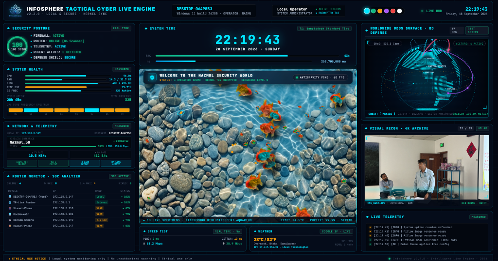

<div align="center">

# 🌐 INFOSPHERE · TACTICAL CYBER LIVE ENGINE
### Executive 60 FPS Live Wallpaper · SOC Intrusion Telemetry · 3D Geospatial Defense Matrix

[-0078D6?style=for-the-badge&logo=windows)](https://www.microsoft.com/windows)
[](https://go.dev/)
[](https://www.python.org/)
[](https://www.rust-lang.org/)
[](https://nextjs.org/)
[](https://github.com/nazmulhaquebz/InfoSphere_wallpaper)
[](LICENSE)
[](SECURITY.md)

<br/>



<br/>

**Transform your standard Windows desktop into an aerospace-grade, real-time Security Operations Center (SOC) HUD.**<br/>
Native Windows `WorkerW` embedding · Zero desktop icon collision · 100% background silent operation.

</div>

---

## 🛡️ Ethical Use & Responsible Monitoring Manifesto

> [!IMPORTANT]
> **PLEASE READ BEFORE USE:**
> 
> **InfoSphere** is engineered strictly for **defensive, aesthetic, educational, and authorized personal workstation observability**.
> 
> - **Authorized Use Only**: Only monitor hardware, network interfaces, and routers that you personally own or have explicit authorization to inspect.
> - **No Malicious Capability**: InfoSphere contains **no offensive exploit tools, credential harvesters, port flooding, or unauthorized packet sniffing capabilities**.
> - **Local-Only Privacy**: All system metrics, local ARP tables, and telemetry snapshots reside exclusively in volatile memory and local JSON storage (`127.0.0.1`). **No user data, keystrokes, or network credentials are ever sent to external cloud servers or third-party trackers.**
> - **Empty Media Privacy**: The repository ships with an empty picture directory (`Picture/Original Picture/`); your personal photos stay strictly on your local disk and are never uploaded to GitHub.
> - **Ethical Compliance**: Users worldwide must adhere to their local cybersecurity laws, computer fraud statutes, and organizational Acceptable Use Policies (AUP).

---

## 💻 Runtimes & Tech Stack: Language & Framework Versions

InfoSphere brings together high-performance, modern technologies (Python, Go, Rust, and Node.js/Next.js).  
**Here is the exact version ledger and runtime requirements for each component:**

| Technology | Role in InfoSphere | Installed / Verified Version | Is It Required Before Install? | Pre-Compiled in Repo? | Terminal Install Command |
|---|---|---|---|---|---|
| **🐍 Python** | Hardware telemetry engine, system counters, speedtest, weather | **Python 3.14.7** (Supports 3.10+) | **✅ REQUIRED FIRST TIME** | No (Interpreted) | `winget install Python.Python.3.12` |
| **🌐 Edge WebView2** | Renders HTML5/CSS3/WebGL wallpaper behind desktop icons | **Evergreen Runtime** | **✅ REQUIRED** (Built-in on 99% of PCs) | Pre-installed on Windows 10/11 | `winget install Microsoft.EdgeWebView2Runtime` |
| **🐹 Go (Golang)** | Native `WorkerW` desktop injector & SSE event hub (`8090`) | **Go 1.26.4** (in `go.mod`) | **❌ OPTIONAL** (For developers only) | **YES** (`infosphere_wallpaper.exe`) | `winget install GoLang.Go` |
| **🦀 Rust** | High-speed security auditor & image thumbnail processor | **rustc 1.96.0** (Native) | **❌ OPTIONAL** (For developers only) | **YES** (`security_audit.exe`, `image_processor.exe`) | `winget install Rustlang.Rustup` |
| **⚡ Node.js / Next.js**| Optional standalone Jarvis web dashboard (`http://localhost:8080`) | **Node.js v26.9.0 (npm 11.19.1) · Next.js 16.3.5 (React 19.2.4)** | **❌ OPTIONAL** (Wallpaper runs independently) | Dependencies configured in `jarvis/` | `winget install OpenJS.NodeJS` |

> [!CAUTION]
> **WHEN INSTALLING PYTHON VIA GUI:** You **MUST** check the box that says:  
> **`☑ Add python.exe to PATH`** on the very first installer screen!  
> If using `winget` in the terminal, it is added to PATH automatically.

---

## 🎯 User Customization Boundaries: What You Can Change (The ONLY 3 Items)

> [!IMPORTANT]
> **STRICT CUSTOMIZATION BOUNDARY FOR ALL USERS WORLDWIDE:**  
> InfoSphere is engineered as an out-of-the-box, pre-calibrated live wallpaper. To ensure 100% desktop stability, prevent rendering breakage, and protect the engine, **you only ever need to touch or customize these 3 items**:
>
> 1. 👤 **`user_information.txt`** — Customize your Call-Sign, Full Name, Central Command Header banner, and Role Title.
> 2. 🖼️ **`Picture/Original Picture/`** — Drop your personal `.jpg` or `.png` photos/wallpapers here for the Visual Recon 4K Archive panel.
> 3. 🔐 **`.env`** (copied from `.env.example`) — Optional: Set your router gateway IP and password for SOC intrusion telemetry (or leave blank for passive ARP mode).
>
> ⛔ **DO NOT MODIFY ANY OTHER FILES:**  
> **Never modify** `main.py`, `infosphere_live_wallpaper.html`, `core/`, `css/`, `infosphere_wallpaper.exe`, `START_INFOSPHERE.bat`, `STOP_INFOSPHERE.bat`, or `config.json`. Everything in the engine is automated and pre-configured out-of-the-box.

---

## 🚀 Step-by-Step Installation ("One by One" with Terminal Code)

Open **PowerShell** or **Command Prompt** (Run as Administrator or standard user) and execute these steps one by one:

### Step 1: Install Required Runtime (First Time Only)
Verify if Python is installed:
```cmd
python --version
```
If Python is not installed, install it in one command via Windows Package Manager:
```cmd
winget install Python.Python.3.12
```
*(After installing via winget, restart your terminal to reload your PATH).*

---

### Step 2: Clone the GitHub Repository
Clone the repository to your preferred directory (e.g. `C:\InfoSphere_wallpaper`):
```cmd
git clone https://github.com/nazmulhaquebz/InfoSphere_wallpaper.git
cd InfoSphere_wallpaper
```

---

### Step 3: Install Python Dependencies
Install the required lightweight Python libraries:
```cmd
python -m pip install -r requirements.txt
```
*This installs three standard packages: `Pillow`, `psutil`, and `speedtest-cli`.*

---

### Step 4: Configure Router & Credentials via `.env` (Blank by Default)
InfoSphere comes with a clean template file: [`.env.example`](.env.example).  
Create your local `.env` configuration:
```cmd
copy .env.example .env
```
Open `.env` in Notepad or your preferred editor:
```cmd
notepad .env
```
```env
# Router Gateway IP (e.g. 192.168.0.1, 192.168.1.1, or leave blank)
INFOSPHERE_ROUTER_IP=

# Router Administrative Portal Username (leave blank if not logging into web portal)
INFOSPHERE_ROUTER_USERNAME=

# Router Administrative Portal Password (leave blank if not logging into web portal)
INFOSPHERE_ROUTER_PASSWORD=
```
> [!TIP]
> **Zero-Configuration Mode:** You can leave all three fields **BLANK**! InfoSphere automatically uses native in-process Win32 ARP hardware discovery to detect connected devices (phones, cameras, PCs) without needing your router password.

---

### Step 5: Add Personal Photos to Visual Recon (Optional Customization #2)
The repository ships with an empty picture directory for privacy: `Picture/Original Picture/`.  
To display your own personal wallpapers or photos in the **Visual Recon 4K Archive** HUD panel:
```cmd
explorer "Picture\Original Picture"
```
Drag and drop your favorite `.jpg` or `.png` photos into that folder!

---

### Step 6: Personalize Your Name & HUD (Customization #3)
Customize the central command banner and your operator name on your live wallpaper:
```cmd
notepad user_information.txt
```
Edit your name or title, save the file, and you are ready!

---

### Step 7: Launch InfoSphere Live Wallpaper
Start the live wallpaper engine:
```cmd
START_INFOSPHERE.bat
```
*(Or simply double-click **`START_INFOSPHERE.bat`** in Windows Explorer).*

**What happens automatically:**
1. Silently launches the Python telemetry engine in the background (`main.py` via `pythonw.exe`).
2. Launches the Go live wallpaper host (`infosphere_wallpaper.exe`).
3. Injects the 60 FPS HUD and Antigravity Aquarium behind your desktop icons in `WorkerW`.
4. Your desktop icons, right-clicks, and window dragging remain **100% normal and responsive**.
5. Runs **completely silently in the background with zero command prompt windows**.

---

### Step 8 (Optional): Enable Auto-Start on Windows Login
To have InfoSphere start automatically every time you turn on your computer:
```cmd
install_autostart_windows.bat
```
- Adds a silent startup entry to your Windows registry (`HKCU\Software\Microsoft\Windows\CurrentVersion\Run`).
- Starts with zero console popups on boot.
- To disable autostart anytime, run: `remove_autostart_windows.bat`.

---

### Step 9: How to Stop the Wallpaper
To turn off the wallpaper and restore your regular desktop background:
```cmd
STOP_INFOSPHERE.bat
```
- Cleanly terminates `infosphere_wallpaper.exe`, WebView2, and `main.py`, and releases port 8090.

---

## 🛠️ Developer Guide: Compiling Go & Rust from Source (Optional)

If you have Go and Rust installed and wish to recompile the native binaries:

### Compile Go Wallpaper Injector & SSE Hub:
```cmd
cd core\wallpaper
go build -ldflags="-H=windowsgui -s -w" -buildvcs=false -o ..\..\infosphere_wallpaper.exe .
cd ..\..
```

### Compile Rust Security Auditor:
```cmd
cd core\scanner
rustc -O security_audit.rs -o ..\bin\security_audit.exe
cd ..\..
```

### Launch Optional Jarvis Next.js Dashboard:
```cmd
cd jarvis
npm install
npm run dev
```
*Access Jarvis dashboard locally at `http://127.0.0.1:8080`.*

---

## 👤 Personalize Your Name & Desktop HUD (`user_information.txt`)

Any user worldwide can customize the central command banner and their name on their desktop HUD anytime without modifying code:

Open **`user_information.txt`** in Notepad or any text editor:
```cmd
notepad user_information.txt
```
```ini
# Your Name or Call-Sign (e.g. NAZMUL, ALEX, CYBER_OPERATOR)
NAME=NAZMUL

# Central Command Banner Header (Displayed above the 60 FPS Antigravity Pond)
WELCOME_TITLE=WELCOME TO THE NAZMUL SECURITY WORLD

# Security Status Subtitle & Ticker
STATUS_SUBTITLE=● ADVANCED TACTICAL THREAT SHIELD · ACTIVE PERIMETER SCAN

# Operator Role / Title (displayed in the top header)
ROLE_TITLE=SYSTEM ADMINISTRATOR
```

> [!TIP]
> **Instant Live Sync**: As soon as you save `user_information.txt`, the live wallpaper automatically updates the central banner, operator pill, and status ticker in real time!

---

## ⚙️ Configuration Reference (`config.json`)

> [!NOTE]
> **INTERNAL ENGINE PRESETS:**  
> Standard users **do not** need to edit `config.json`. All normal personalizations (name, photos, router credentials) are cleanly handled via `user_information.txt`, `Picture/Original Picture/`, and `.env`. Advanced developers can inspect the engine defaults below:

All features can also be configured directly in `config.json`:

| Parameter | Type | Default | Description |
|---|---|---|---|
| `refresh_interval_seconds` | Float | `1.0` | Telemetry refresh frequency (seconds) |
| `show_weather` | Boolean | `true` | Enable/disable Google IP weather module |
| `weather_city` | String | `"auto"` | `"auto"` for automatic IP geolocation |
| `speedtest.enabled` | Boolean | `true` | Enable/disable real-time speed benchmark |
| `speedtest.speed_interval_s`| Integer | `15` | Interval between speed tests (seconds) |
| `router.enabled` | Boolean | `true` | Enable/disable hardware SOC network analyzer |
| `router.refresh_secs` | Integer | `10` | Frequency of ARP table sweep |

---

## 📜 Version Control Ledger

InfoSphere includes a dedicated version ledger and automated management system:
- Check version and release history: See [`CHANGELOG.md`](CHANGELOG.md).
- To bump versions with today's date automatically:
  ```cmd
  python bump_version.py 2.3.1 "Release notes"
  ```
  *(Or double-click `bump_version.bat`).*

---

## 🔒 Privacy & Data Security Guarantee

- **Zero Cloud Leakage**: No telemetry, system configurations, Wi-Fi SSIDs, or hardware MAC addresses are transmitted to external servers.
- **Loopback Enforcement**: Internal communication uses strictly `127.0.0.1`.
- **Passive Read-Only Inspection**: Network discovery uses standard operating system ARP lookups; it never transmits aggressive packets, port scans, or exploitation payloads.
- **Git Privacy**: `.gitignore` strictly protects your personal photos in `Picture/` and router passwords in `.env` from ever being pushed to GitHub.

---

## 👨‍💻 Author & Acknowledgements

- **Lead Developer**: **Mohammad Nazmul Haque**
- **GitHub**: [@nazmulhaquebz](https://github.com/nazmulhaquebz)
- **Location**: Tulshipur, Madhabpur, Habiganj, Bangladesh
- **Contact**: [nazmul2121@gmail.com](mailto:nazmul2121@gmail.com)

---

## 📜 License

This project is open-source under the **MIT License with Ethical Use Addendum**.  
See the full [`LICENSE`](LICENSE) file for complete terms.

```
Copyright (c) 2026 Mohammad Nazmul Haque. All rights reserved.
Ethical System Observability · Defensive Workstation HUD · Made with ❤️ for the Global Community.
```
